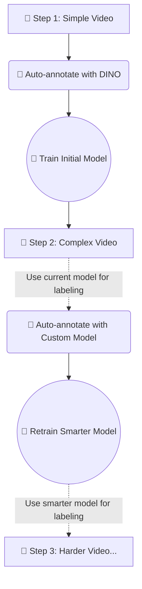
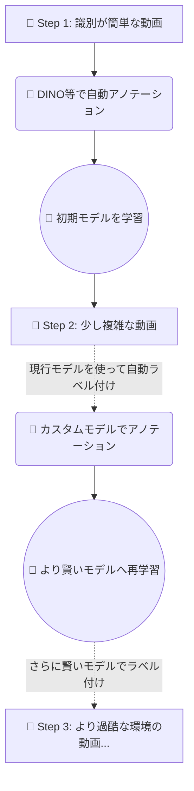

# YOLO Finetune Pipeline

[English](#english) | [日本語](#japanese)

---

<a id="english"></a>
## English

This repository provides a complete pipeline to automatically create object detection datasets from videos and fine-tune YOLO models with your own dataset.

It leverages zero-shot detection models like **Grounding DINO** and **YOLO-World** to completely automate the annotation (labeling) process.

### 🌟 Iterative Bootstrapping: How to Build a Robust Model

The most reliable approach to building a powerful custom object detector with this tool is to start simple and gradually increase the complexity of your data (a concept similar to curriculum learning).

1. **Phase 1: Bootstrapping with a "Simple Video"**
   - Start by recording a video where the target object is clearly visible against a clean, simple background.
   - Use an open-vocabulary model like Grounding DINO (`--model dino`) to automatically generate a highly accurate initial dataset without manual labeling.
   - Use this "easy" dataset to fine-tune a small base YOLO model.

2. **Phase 2: Tackling "Slightly Complex Videos"**
   - Next, record videos in slightly more complex environments (e.g., cluttered backgrounds, different lighting conditions).
   - This time, instead of the generic model, use your **newly trained custom model from Phase 1** to automatically annotate the new data (`--model custom`).
   - Since your custom model has already learned the specific features of your target, it can provide more consistent and domain-specific annotations than generic text-based models.

3. **Phase 3: Iterating Towards a Robust Model**
   - Fine-tune your model again using the newly generated, more complex dataset.
   - By repeating this cycle (record harder video -> auto-annotate with current custom model -> retrain), you will gradually evolve a highly robust model capable of handling real-world edge cases.

#### 🔄 The Iteration Cycle


### ⚙️ Environment Setup

This repository supports package management via `pyproject.toml`.
Follow these steps to install the required libraries (including `transformers` for DINO) and build a reproducible environment.

After cloning the repository to your local PC (or cloud environment), run the following:

```bash
# UV
uv venv
source .venv/bin/activate

# Install all required packages
uv sync
```

---

### 🚀 Step 1: Data Creation (`create_dataset.py`)

Automatically generates a training dataset in YOLO format by inputting the source video file and "target texts" you want to detect.
During generation, train and validation data are not split; everything is stored in the `images` and `labels` directories, making data management extremely simple.

#### Basic Usage (Using DINO)

DINO (Grounding DINO) is a highly accurate text-based object detection model. Simply specifying `--model dino` will automatically download and run the model from Hugging Face.

```bash
# Pattern 1: Creating with Grounding DINO
uv run python create_dataset.py my_video.mp4 --targets "door handle:0" "button:1" --model dino --dir my_dataset_room
```

#### Using Other Models

You can also use the high-speed YOLO-World or a pre-trained custom model as an annotator.

```bash
# Pattern 2: Creating quickly with YOLO-World
uv run python create_dataset.py my_video.mp4 --targets "door handle:0" "button:1" --model yolo --dir my_dataset_room

# Pattern 3: Using an already trained custom YOLO model
uv run python create_dataset.py my_video.mp4 --targets "door handle:0" "button:1" --model custom --custom_weights path/to/best.pt --dir my_dataset_room

# Pattern 4: Generating video with background only (negative samples)
uv run python create_dataset.py background.mp4 --negative --dir my_dataset_background
```

**Useful Options:**
- `--interval <number>`: Frame extraction interval from the video. Default is `5`.
- `--threshold <number>`: Confidence threshold for text detection. Default is `0.35`.

---

### 🚀 Step 2: Model Training (`train.py`)

Runs YOLO model training using the created datasets.
During training, images are dynamically shuffled and automatically split into "Train" and "Validation (Val)" based on the specified ratio (`val_ratio`).

#### Writing the Training Configuration File

Create a configuration file with any name (e.g., `train_config.yaml`).

```yaml
# train_config.yaml

datasets:
  - my_dataset_room        # Folder name created by create_dataset.py
  - my_dataset_background  # Negative samples can also be included

val_ratio: 0.2           # Assign 20% to validation data (Val) (Default 0.2)
weights: "yolov8m.pt"    # Pre-trained base model
project: "my_models"     # Save destination project folder
name: "room_detector"    # Saved model name
epochs: 100
batch: 16
imgsz: 640
```

#### Starting the Training

Just specify the configuration file and execute the script.

```bash
uv run python train.py train_config.yaml
```

Once training is complete, the model with the highest accuracy will be saved to `my_models/room_detector/weights/best.pt`.

---
<a id="japanese"></a>
## 日本語

このリポジトリは、動画から自動で物体検出のデータセットを作成し、独自のデータセットでYOLOモデルのファインチューニング（追加学習）を行うための一連のパイプラインです。

**Grounding DINO** や **YOLO-World** などのゼロショット検出モデルを利用して、アノテーション（ラベル付け）作業を完全に自動化しています。

### 🌟 効果的な使い方: 段階的パイプライン (Iterative Bootstrapping)

このツールを活用して強力な物体検出器を作るための最も確実なアプローチは、**「識別が簡単なデータから始めて、徐々に動画の難易度を上げていく」**ことです。

1. **Phase 1: 「簡単な動画」から初期モデルを作る**
   - 最初は、背景がすっきりしていて対象物がはっきりと映っている「識別が非常に簡単な動画」を撮影します。
   - Grounding DINO などを使い（`--model dino`）、手作業なしで高精度な初期データセットを作成します。
   - このデータを使って、まずは「小さく」ベースとなる初期YOLOモデルをファインチューニングします。

2. **Phase 2: 「少し複雑な動画」への挑戦**
   - 次に、背景が少し複雑な場所や、照明条件が異なる「中級レベルの難易度の動画」を用意します。
   - 今度は汎用モデルを使うのではなく、**Phase 1で鍛えた自分自身のカスタムモデル**（`--model custom`）を使って自動アノテーションを行います。
   - カスタムモデルはすでに対象物の特徴をピンポイントで学習しているため、DINOの汎用的なテキスト認識よりも、対象に特化した一貫性のある妥当なアノテーションが期待できます。

3. **Phase 3: 反復による堅牢な（Robust）モデルの育成**
   - 新しく自動生成されたデータを使って、再びモデルを学習（更新）させます。
   - 「より実環境に近い難しい動画の撮影 → 現行のカスタムモデルでアノテーション → 再学習」というサイクルを繰り返すことで、最終的にあらゆるエッジケースに対応できる、本番環境に強いモデルへと段階的に育て上げることができます。

#### 🔄 成長のサイクル図


### ⚙️ 依存環境のセットアップ

本リポジトリは `pyproject.toml` によるパッケージ管理をサポートしています。
以下の手順で、必要なライブラリ（DINO用の `transformers` 含む）をインストールし、再現可能な環境を構築します。

ご自身のPC（またはクラウド環境）にリポジトリをクローンした後、以下を実行してください。

```bash
# UV
uv venv
source .venv/bin/activate

# 必要なパッケージをまとめてインストール
uv sync
```

---

### 🚀 ステップ1: データ作成 (`create_dataset.py`)

元の動画ファイルと、検出したい「ターゲットのテキスト」を入力して、YOLOフォーマットの学習データセットを自動生成します。
生成時に訓練用・検証用データの分割は行わず、すべて `images` と `labels` フォルダに格納されるため、データ管理が非常にシンプルです。

#### 基本的な使い方（DINO を使用する場合）

DINO（Grounding DINO）は非常に高精度なテキストベースの物体検出モデルです。`--model dino` を指定するだけで、Hugging Faceから自動的にモデルがダウンロードされ、実行されます。

```bash
# パターン1: Grounding DINOで作成
uv run python create_dataset.py my_video.mp4 --targets "door handle:0" "button:1" --model dino --dir my_dataset_room
```

#### そのほかのモデルを使用する場合

高速な YOLO-World や、学習済みのカスタムモデルをアノテーターとして使用することも可能です。

```bash
# パターン2: YOLO-Worldで高速に作成
uv run python create_dataset.py my_video.mp4 --targets "door handle:0" "button:1" --model yolo --dir my_dataset_room

# パターン3: すでに学習済みのカスタムYOLOを使う
uv run python create_dataset.py my_video.mp4 --targets "door handle:0" "button:1" --model custom --custom_weights path/to/best.pt --dir my_dataset_room

# パターン4: 背景のみの動画（ネガティブサンプル）を生成
uv run python create_dataset.py background.mp4 --negative --dir my_dataset_background
```

**便利なオプション:**
- `--interval <数値>`: 動画から何フレームごとに画像を抽出するか。デフォルトは `5` です。
- `--threshold <数値>`: テキストでの検出の確信度しきい値。デフォルトは `0.35` です。

---

### 🚀 ステップ2: モデルの学習 (`train.py`)

作成したデータセットを利用して、YOLOモデルの学習を実行します。
学習時に、指定した割合（`val_ratio`）で画像を動的にシャッフルして「訓練用(Train)」と「検証用(Val)」に自動で分割します。

#### 学習の設定ファイルを書く

任意の名前（例: `train_config.yaml`）で設定ファイルを作成します。

```yaml
# train_config.yaml

datasets:
  - my_dataset_room        # create_dataset.py で作成したフォルダ名
  - my_dataset_background  # ネガティブサンプルも含めることができます

val_ratio: 0.2           # 20% を検証用データ（Val）に割り当てる (デフォルト0.2)
weights: "yolov8m.pt"    # 事前学習済みベースモデル
project: "my_models"     # 保存先のプロジェクトフォルダ
name: "room_detector"    # 保存するモデル名
epochs: 100
batch: 16
imgsz: 640
```

#### 学習の開始

設定ファイルを指定して、スクリプトを実行するだけです。

```bash
python train.py train_config.yaml
```

学習が完了すると、`my_models/room_detector/weights/best.pt` に最高の精度を出したモデルが保存されます。

---

## License / Disclaimer
This project itself is licensed under the [AGPL-3.0 License](LICENSE).
However, please note that this pipeline heavily relies on the `ultralytics` package (YOLOv8, YOLO-World), which is governed by its own **AGPL-3.0 license**. 
If you intend to use this project or the resulting trained models for closed-source commercial purposes, you must adhere to the [Ultralytics Licensing terms](https://ultralytics.com/license) and may require an Enterprise License from Ultralytics.

本プロジェクトは **AGPL-3.0 ライセンス** のもとで公開されます。
本パイプラインは `ultralytics` パッケージ (YOLOv8, YOLO-World) に強く依存しています。そのため、本プロジェクトおよび学習したモデルをクローズドソースの商用サービス（SaaSやソフトウェアなど）に組み込んで利用する場合は、[Ultralytics社のライセンス規約](https://ultralytics.com/license)に従う必要があり、商用ライセンスの別途購入が必要になる場合がありますのでご注意ください。
